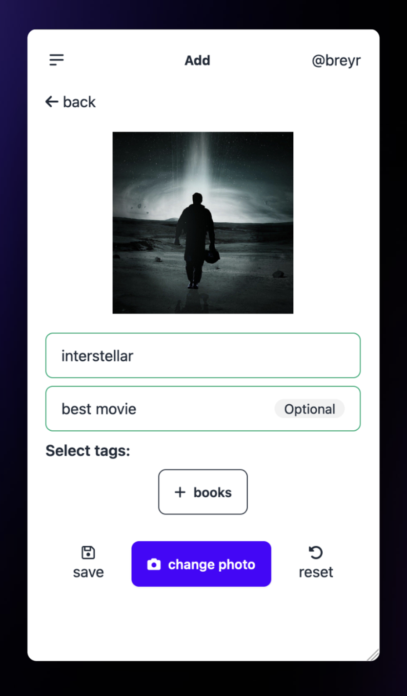
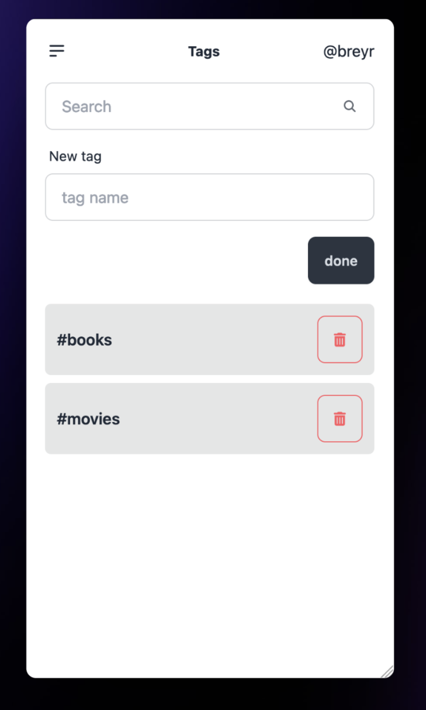
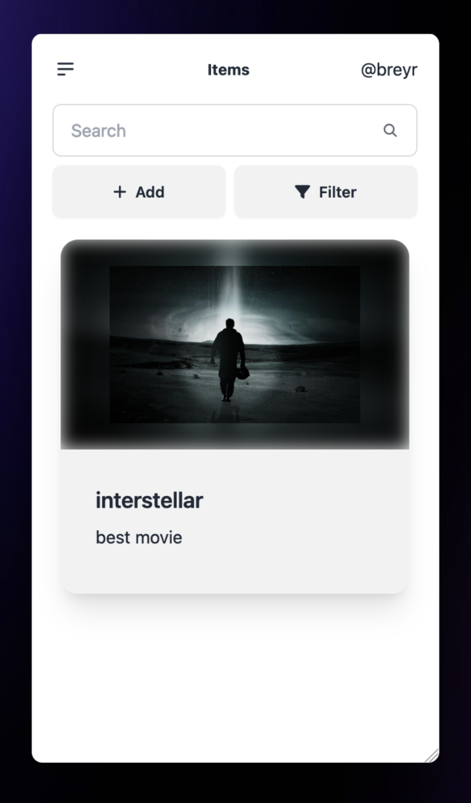

# Picventory

Picventory is a web application designed to provide a simple and elegant picture inventory system. It's built with SvelteKit and hosted on Firebase.

## Project Overview

The primary motivation behind Picventory was to create a convenient platform for storing images of various items. While the initial use case was to help manage a Bath and Body Works collection, the application's functionality extends to a wide range of inventory management needs.

## Features

- **Image Upload:** Users can easily upload images of their items to the platform.
- **Inventory Management:** Users can categorize and manage their items effectively.
- **Search and Filter:** Users can quickly find specific items using the search and filter options.
- **User-friendly Interface:** The application boasts a clean and intuitive interface, making it easy for users to navigate and manage their inventory.

    
    
     

There are light and dark mode themes based on device preferences.

## Getting Started

To get started with Picventory, you can register [here](https://picventory.web.app)

## Contact

If you have any questions, feel free to reach out, breyr2021@gmail.com